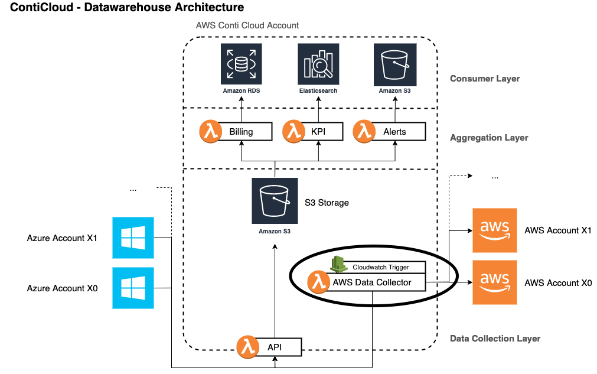

# Opsgenie - Data Collection Service

This service is a data collection service, which requests all alerts of Opsgenie, which were created or updated in the last 6 hours. Currently those will then be stored in a json and a flatterned CSV file.

